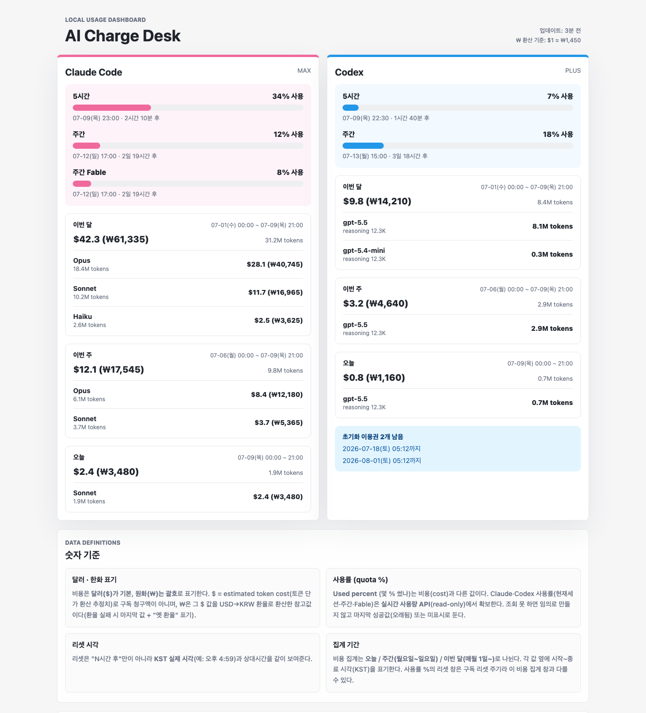

# AI Charge Desk

Claude Code와 Codex를 **얼마나 썼는지(%), 언제 리셋되는지, 이번 달 얼마 썼는지**를 맥 메뉴바에서 한눈에 보는 로컬 도구입니다.

- 메뉴바: `🩷34%  🩵7%` — 왼쪽 Claude·오른쪽 Codex, 숫자는 5시간 창 사용률, 하트가 위험 신호등(아래 "메뉴바 요약")
- 드롭다운: 사용률·리셋 시각·이번 달/주/오늘 비용·Codex 초기화 이용권
- 대시보드(클릭 한 번, 서버 불필요): 모델별 API 비용까지 상세



> 스크린샷의 수치는 예시(가짜 데이터)입니다.

## 왜 만들었나

Claude·Codex 앱은 "남은 사용량"을 각자 앱 안에서만 보여줍니다. 이 도구는 두 서비스의 사용률을 **쓴 비율(used %) 기준으로 통일**해 메뉴바에 상시 표시하고, 토큰 비용 추정치를 원화로 환산해 같이 보여줍니다. 데이터 저장과 비용 계산은 로컬에서 이루어지며, 외부 요청은 사용량 조회와 환율 조회뿐입니다(상세: 아래 "안전·프라이버시").

## 메뉴바 요약 (0.1.8)

서비스당 한 덩어리 `하트⚠️%(원인 %)`. 자리는 고정 — **왼쪽 Claude · 오른쪽 Codex**. 글자색은 시스템 자동(라이트=검정/다크=흰색)이고, **위험 신호는 하트가 전담**합니다.

| 표시 | 뜻 |
| --- | --- |
| `🩷54%  🩵15%` | 평소. 숫자는 각 서비스의 **5시간 창** 사용률 |
| `🧡78%` | 그 서비스 지표(5시간·주간·Fable) 중 하나가 **70%를 넘음** |
| `❤️93%` | 90%를 넘음 — 숫자 자신이 원인이면 이렇게만 |
| `❤️54%(Fable 93%)` | 90%를 넘은 게 메뉴바에 안 보이는 지표(주간·Fable)면 **괄호가 원인을 알려줌** |
| `🩷⚠️54%` | ⚠️ = 그 서비스 데이터가 옛것(하트 바로 뒤) — 한도 경고와는 별개 기호 |
| `🩷--` | 아직 값 없음(첫 수집 전·로그인 없음) |

## 각 숫자의 뜻

| 항목 | 뜻 |
| --- | --- |
| **사용률 (%)** | 해당 창에서 **쓴 비율**. 100%에 가까울수록 한도 임박. 앱이 보여주는 "남음 %"의 반대 방향이니 주의. Claude·Codex 모두 각 서비스의 사용량 endpoint에서 읽어오며, 보통 앱과 같은 기준의 값을 보여주지만 비공식 API 특성상 지연·불일치가 있을 수 있습니다. |
| **5시간 / 주간** | 각 서비스의 rate limit 창. Claude는 모델 전용 창(예: Fable)이 내려오는 기간엔 그 줄도 표시(0%이거나 제공 종료되면 자동으로 사라짐). |
| **리셋 시각** | `07-12(일) 17:00 · 2일 19시간 후` — 그 창이 초기화되는 KST 시각 + 남은 시간. 연도는 올해가 아닐 때만 붙음. |
| **비용 ($, ₩)** | `ccusage`로 계산한 **추정 토큰 비용**(API 단가 환산). **구독 청구액이 아님** — 정액 구독이면 실제 결제액과 무관한 참고치. 원화는 USD→KRW 환율(frankfurter.app) 환산 참고값. **비용은 Claude Code·Codex(코딩 에이전트) 사용만 집계** — CLI·IDE 확장·데스크탑 앱의 [Code]/[Codex] 탭 어디서 쓰든 잡힙니다. **순수 채팅([홈] 탭, claude.ai·chatgpt.com 웹의 일반 대화)만 대상이 아닙니다**(코딩 에이전트 사용의 API 비용을 환산하는 도구라 정상 — 같은 데스크탑 앱이라도 코딩 탭은 잡히고 채팅 탭은 안 잡힘). 또 로컬 세션 로그는 대화(세션)가 끝난 뒤 쌓이므로, **사용률 %**(Anthropic·OpenAI가 계정 기준으로 제공)보다 한 박자 늦게 반영될 수 있습니다(다음 수집에 따라잡음). 버그가 아니라 정상입니다. |
| **이번 달 / 이번 주 / 오늘** | 매월 1일(KST) 시작 / 월요일부터 일요일 / 오늘 0시 시작. 각 패널 우상단에 실제 집계 구간 표기. 사용률 %의 리셋 창과는 별개 기준. |
| **초기화 이용권** | Codex 리셋 크레딧. 남은 개수 + 만료일(임박순). 0개면 표시 안 함. |
| **업데이트: 3분 전** | 마지막으로 데이터를 수집한 시각. SwiftBar가 2분마다 화면을 다시 그리고, 마지막 수집이 10분을 넘으면 자동으로 다시 수집. 드롭다운 "새로고침"으로 즉시 갱신. |
| **하트 뒤 ⚠️ / "⚠️ 옛 데이터(N 전)"** (0.1.3, 위치는 0.1.8부터 하트 뒤) | 그 서비스 값이 실시간이 아니라 **마지막 성공값**(오래됨)이라는 표시. 드롭다운에 원인(토큰 만료 / 로그인 풀림 / 조회 실패)과 해법이 같이 나옵니다. 리셋 카운트다운은 옛 데이터에서도 시계상 흘러가므로 ⚠️ 유무로 신선도를 판단하세요. |

## 요구사항

- macOS (자격 증명을 키체인에서 읽음)
- [SwiftBar](https://swiftbar.app) (`brew install --cask swiftbar`)
- Node.js 18+
- Claude Code 로그인 상태(키체인) 그리고/또는 Codex 앱 로그인 상태(`~/.codex/auth.json`) — 한쪽만 있어도 그쪽만 표시됩니다.

**검증된 환경**: macOS 15.6 (Apple Silicon) · Node v22.22.3 · SwiftBar 2.0.1 — 이 조합에서 실사용 확인. 다른 조합은 동작해야 하지만 직접 검증하지는 않았습니다.

## 설치 — Claude Code/Codex에 복붙

Claude Code(또는 Codex)에 아래를 붙여넣고 실행하게 하면 됩니다:

```text
https://github.com/oimoaoa/ai-charge-desk 설치해줘.

1. 계속 둘 도구 폴더(없으면 ~/tools 를 새로 만들어)에 git clone
2. 클론한 폴더에서 npm install
3. SwiftBar가 없으면 brew install --cask swiftbar 로 설치하고 한 번 실행하게 안내해줘.
   SwiftBar 첫 실행 때 "플러그인 폴더"를 지정하는 창이 뜨는데 그건 내가(사람이) 직접 고르는 거야 —
   내가 지정을 마치면 그 폴더 경로를 너에게 알려줄게.
4. 내가 알려준 SwiftBar 플러그인 폴더 안에 심볼릭 링크를 만들어줘 (복사 금지 — 링크여야 함):
   ln -s <클론경로>/swiftbar/ai-charge-desk.2m.js <SwiftBar플러그인폴더>/
5. 클론한 폴더에서 node scripts/build-snapshot.mjs 를 한 번 실행해 수집이 되는지 확인.
   이때 macOS가 "키체인 항목에 접근 허용?" 창을 띄우면 "항상 허용"을 누르라고 안내해줘(사용량을 읽기 위한 것).
6. 메뉴바에 "🩷n%  🩵n%"가 뜨면 성공. README의 "메뉴바 요약"과 "각 숫자의 뜻"을 요약해서 설명해줘.

참고: 이 도구는 토큰을 읽기만 하고 갱신(refresh)하지 않아서 로그인에 영향을 주지 않아.
숫자가 "--"로 나오면 아직 첫 수집 전이거나 해당 서비스에 로그인이 안 된 상태야.
```

> 💡 붙여넣으면 AI가 **뭐가 설치되는지 먼저 설명**하고 단계별로 도와줘요. 중간에 macOS 권한 승인 창이 떠도 정상이에요(키체인은 "항상 허용"). 실패하면 그 **에러 메시지를 그대로 AI에게** 보여주세요.

> ⚠️ **clone한 폴더는 지우거나 옮기지 마세요** — 설치가 심볼릭 링크라 그 폴더가 실행 원본이에요(옮기면 메뉴바가 멈춰요 → 설치 4단계 `ln -s`만 다시 실행하면 복구). 그래서 `~/Downloads` 같은 임시 위치 말고 `~/tools`처럼 계속 둘 곳에 두세요.

수동으로 하려면 위 **1–5단계**(6번은 AI가 설명해 주는 단계라 수동 설치엔 불필요)를 터미널에서 그대로 실행하면 됩니다.

## 업데이트

이 도구는 **심볼릭 링크(symbolic link)로 설치**하므로, 최신 버전을 받는 건 clone한 폴더에서 `git pull` 한 번이면 됩니다:

```bash
cd <클론한 폴더> && git pull
```

- **재설치가 필요 없습니다.** 심볼릭 링크는 "clone한 폴더 안의 플러그인 파일을 가리키는 바로가기"라, `git pull`로 그 파일이 갱신되면 SwiftBar가 다음 새로고침(최대 2분)에 자동으로 최신 코드를 실행합니다. (즉시 반영하려면 드롭다운 "새로고침".)
- **자동으로 오지는 않습니다.** GitHub은 새 버전이 나왔다고 알려주지 않으므로, 업데이트를 받으려면 위 `git pull`을 **직접** 실행해야 합니다. 가끔 확인해 주세요.
- **fork(포크)는 필요 없습니다.** `git clone`만 한 상태면 이 저장소가 `origin`으로 잡혀 있어 `git pull`로 바로 업데이트를 받습니다. fork는 직접 코드를 고쳐 올리거나 수정을 제안(PR)할 때만 필요합니다.

**🙋 개발 몰라도 됩니다** — 아래를 Claude Code(또는 Codex)에 붙여넣으면 대신 업데이트해줍니다:

```
AI Charge Desk를 최신으로 업데이트해줘. 내가 clone한 폴더에서 git pull을 실행하고, SwiftBar 드롭다운의 "새로고침"으로 최신이 반영됐는지 확인해줘. 폴더 위치를 모르면 나한테 먼저 물어봐줘.
```

> 파일 이름·폴더 구조가 바뀌는 큰 업데이트가 아니면 심볼릭 링크는 그대로 유지됩니다. (드물게 링크가 깨지면 설치 4단계의 `ln -s`만 다시 실행하면 됩니다.)

## 🎨 색이 흐리게 보이면 — 색상 커스터마이즈

드롭다운 글씨 색은 `swiftbar/ai-charge-desk.2m.js` 위쪽 "// 색" 블록 한 곳에 모여 있습니다.
(메뉴바 요약 줄은 0.1.8부터 글자색을 아예 안 써서 — 심각도는 하트 이모지가 표시 — 여기 해당 없습니다.)
SwiftBar 색은 `라이트색,다크색` 형식이에요(쉼표 앞=밝은 배경용, 뒤=어두운 배경용, 하나만 쓰면 두 모드 공통). 모두 hex 코드(`#RRGGBB`).

- `WARN`(70%+ 주의) · `DANGER`(90%+ 위험) · `INK`(본문) · `DETAIL`(비용·이용권 날짜, `INK`와 같은 고대비 색·`┗`로 종속 표시) · `SUBTLE`(버전·데이터 나이) · `CLAUDE`/`CODEX`(서비스 헤더).
- SwiftBar 2.0.1은 동작 없는 색상 행을 흐리게 렌더합니다. Claude/Codex 정보 행은 `refresh=true`로 또렷하게 표시하며, 행을 눌러도 데이터 수집은 하지 않고 화면만 다시 그립니다. 실제 데이터를 다시 모으려면 위쪽의 명시적 새로고침 버튼을 사용하세요.
- 라이트 모드에서 흐리면 그 색의 **쉼표 앞(라이트) 값을 더 진하게** 바꾸세요. 밝은 배경에선 밝은 색이 오히려 흐려 보이니, 라이트 쪽은 어두운 톤으로 고르는 게 좋아요.
- 바꾼 뒤 SwiftBar 드롭다운의 "새로고침"을 한 번 누르면 반영됩니다.

> 개발을 몰라도 됩니다 — 이 안내를 그대로 Claude Code(또는 Codex)에 붙여넣고
> "DETAIL 색을 더 진하게 바꿔줘"처럼 부탁하면 알아서 고쳐줍니다.

## 안전 · 프라이버시

- **프롬프트·대화·코드 내용은 수집·저장·전송하지 않습니다.** 이 도구가 다루는 것은 사용량·한도 API 응답과, 비용 계산에 필요한 토큰 집계(로컬 사용 기록에서 ccusage가 산출)뿐입니다.
- **읽기 전용**: 저장된 access token으로 사용량을 조회만 합니다. 토큰을 갱신(refresh)하거나 쓰지 않으므로 **Claude/Codex 로그인이 깨지지 않습니다.** 드롭다운의 "토큰 갱신하기" 버튼(0.1.3)도 토큰을 만지지 않습니다 — `claude`를 한 번 호출해 Claude Code가 스스로 갱신하게 깨울 뿐입니다.
- 토큰 값은 화면·파일·로그 어디에도 출력·저장하지 않습니다.
- 첫 수집 때 macOS가 **키체인 접근 허용** 창을 띄울 수 있습니다(Claude 토큰을 읽기 위한 것). "항상 허용"을 눌러야 이후 자동 수집이 조용히 돌아갑니다.
- 수집한 사용량 데이터는 repo 안 `data/` 폴더(로컬, gitignore)에만 저장됩니다. **이 도구가 직접 보내는 요청**은 두 서비스의 사용량 조회와 환율 API(frankfurter.app)입니다. 비용 계산은 별도 오픈소스 도구 [ccusage](https://github.com/ryoppippi/ccusage)가 로컬 사용 기록으로 수행합니다.

## ⚠️ 비공식 API 주의

사용률·이용권 조회는 문서화되지 않은 endpoint(`api.anthropic.com/api/oauth/usage`, `chatgpt.com/backend-api/wham/usage`, `chatgpt.com/backend-api/wham/rate-limit-reset-credits`)를 사용합니다. 공식 지원 대상이 아니어서 **예고 없이 바뀌거나 막힐 수 있고**, 그 경우 이 도구는 값을 지어내는 대신 "미표시/오래됨"으로 정직하게 표시합니다. 사용은 각자 판단·책임으로.

## 문제 해결

- **메뉴바가 `🩷--  🩵--`**: 첫 수집 전이거나 로그인 없음 → 드롭다운 "새로고침" 또는 `node scripts/build-snapshot.mjs` 실행 후 오류 메시지 확인.
- **메뉴바에 "⚠️ node 없음" / "설치 경로를 못 찾았어요"**: 전자는 Node.js 미설치(`brew install node`), 후자는 플러그인을 심볼릭 링크가 아니라 **복사**로 설치한 경우 — 링크(`ln -s`)로 다시 설치하세요.
- **Claude 쪽만 안 나옴 / ⚠️가 붙음**: 드롭다운의 원인 표시를 보세요(0.1.3).
    - "**Claude 토큰 만료**" → 드롭다운 "**토큰 갱신하기** (Claude 1회 호출)" 클릭. 아주 작은 `claude` 호출 1번으로 Claude Code가 스스로 토큰을 갱신합니다(이 도구는 여전히 토큰을 직접 다루지 않음). 터미널에서 `claude`를 한 번 실행해도 같습니다. 이 버튼은 Claude 사용량을 아주 조금 소모합니다.
    - "**Claude 로그인 풀림**" → refresh token까지 만료된 상태라 갱신으로는 안 되고, 터미널에서 `claude` 실행 후 `/login`으로 재로그인해야 합니다. 데스크톱 앱만 쓰는 경우에도 CLI 로그인은 별도입니다(이 도구는 CLI 자격을 읽습니다).
    - "갱신 실패 — …" → Claude Code 대화방(세션)에 "AI Charge Desk 토큰 갱신해줘"라고 부탁하면 에이전트가 같은 절차를 대신 실행해 줍니다.
    - "**키체인 접근 실패**" → `node scripts/build-snapshot.mjs`를 터미널에서 실행해 키체인 창에서 "항상 허용"을 누르세요.
    - **갱신·재로그인을 해도 "토큰 만료"가 계속될 때(유령 항목)**: 키체인에 같은 이름(`Claude Code-credentials`) 항목이 두 개 이상이면(예: 계정명 없는 만료된 옛 항목) 기본 조회가 첫 매치만 돌려줘 진짜 항목이 안 읽힐 수 있습니다. v0.1.6부터 첫 매치가 만료돼 있으면 **맥 사용자 계정명으로 한 번 더 정조준**해 진짜 항목을 찾습니다(항목 나열·수정 없음 — 읽기 전용 유지).
    - **`claude setup-token`(CI용 장기 토큰)이나 API 키로 인증 중이라면**: 그 인증은 키체인을 거치지 않아 사용률(%)이 구조적으로 안 나옵니다(비용·Codex는 정상). **구독자라면 터미널에서 `claude /login` 한 번**이면 키체인에 구독 인증이 생겨 %가 살아나고, 기존 토큰/키 인증은 우선순위가 더 높아 CI·스크립트에 영향이 없습니다. (v0.1.5부터 "토큰 갱신하기" 버튼도 이 환경에서 키체인을 정확히 갱신하도록 보강)
- **Codex 쪽만 안 나옴**: Codex 앱에 로그인돼 있는지 확인(`~/.codex/auth.json`).
- **열려 있는 대시보드 탭이 예전 시각을 보여줄 때**: 대시보드는 서버 없는 정적 파일이라 탭은 "연 시점의 스냅샷"입니다. 드롭다운 "새로고침" 후 **브라우저 새로고침(⌘R)** 하면 최신으로 바뀝니다.
- **끄고 싶을 때**: SwiftBar에서 이 플러그인 Disable — 표시·자동수집 모두 멈춥니다.

## 라이선스

MIT License. See [LICENSE](LICENSE).
